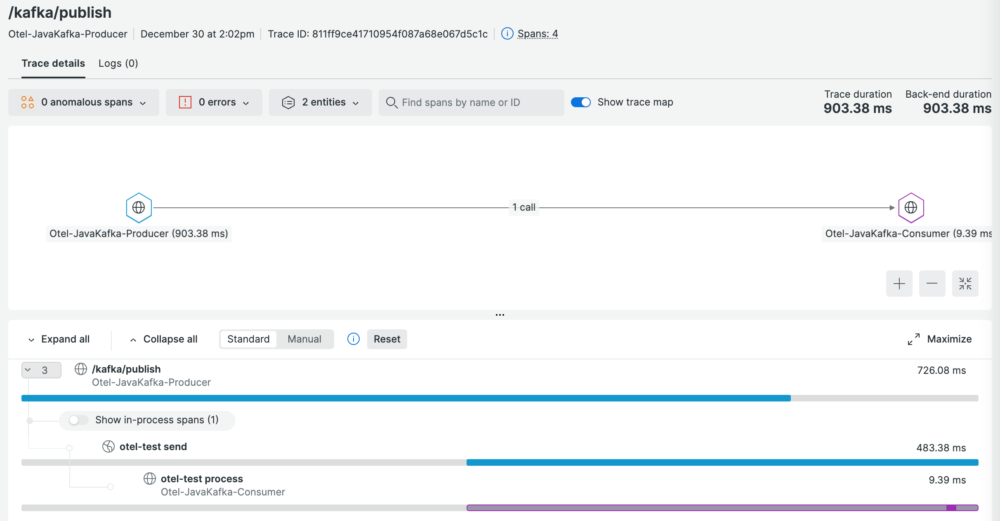

# OTel Distributed tracing of Kafka messages in java

This repo contains a demo for instrumenting distributed tracing using the OTel Java agent for a Java consumer and producer via a Kafka message queue.

The example is a modified version of this [example project](https://github.com/igorkosandyak/spring-boot-kafka) referenced by this [blog post](https://www.confluent.io/blog/apache-kafka-spring-boot-application/). The OTel portion is based on this [example project](https://github.com/antonmry/kafka-playground/tree/main/otel-demo).

# Kafka Setup

## Installation

Download and install Kafka following these instructions: https://kafka.apache.org/quickstart

Notice these changes had to be made in `config/server.properties` for MacOS:

* Amend property to mention localhost: `listeners=PLAINTEXT://localhost:9092`

* Add this property: `delete.topic.enable=true`

##  Running Kafka Commands
Run all of this from within kafka directory. You might need multiple terminal windows to run all this together. I would suggest running zookeeper, kafka, the consumer CLI and the producer CLI in separate console windows. Then run the producer/consumer in other terminal windows.

*Run all these commands from within the kafka root folder.*

**Start zookeeper:**
`bin/zookeeper-server-start.sh config/zookeeper.properties`

**Start kafka:**
`bin/kafka-server-start.sh config/server.properties`

**Create a topic called 'otel-test'** (do this once)
`bin/kafka-topics.sh --create --bootstrap-server localhost:9092 --replication-factor 1 --partitions 1 --topic otel-test`

**Delete a topic called 'otel-test'** 
You might need to to this and recreate topic as above if the consumer doesn't seem to pick up the data.
`bin/kafka-topics.sh  --bootstrap-server localhost:9092  --delete --topic otel-test`

**Test Producer:**
Use this to manually send messages to kafka using the cli
`bin/kafka-console-producer.sh --broker-list localhost:9092 --topic otel-test`

**Test Consumer:**
Use this to view messages as they go through kafka cli
`bin/kafka-console-consumer.sh --bootstrap-server localhost:9092 --topic otel-test --from-beginning`

Tip: If the consumer doesn't log out any messages then delete and recreate the topic.

# App Configuration

## Add the OTel Agent and OTLP Settings

The agent has been downloaded in the `lib` folder of both consumer and producer applications. To add it to the applications when launched from Maven, add the following environment variable. Open a different terminal window for both consumer and producer.

```sh
export MAVEN_OPTS="-javaagent:$PWD/lib/opentelemetry-javaagent.jar"
```

It also requires some variables to configure where apps are going to send metrics and traces. In the case of New Relic (US accounts):

```sh
export OTEL_EXPORTER_OTLP_ENDPOINT="https://otlp.nr-data.net:4317"
export OTEL_EXPORTER_OTLP_HEADERS=api-key=YOUR-API-KEY
```

## Running the Applications

Start the apps from its respective terminal windows:

Producer:

```sh
export OTEL_SERVICE_NAME=Otel-JavaKafka-Producer
./mvnw  spring-boot:run
```

Consumer:

```sh
export OTEL_SERVICE_NAME=Otel-JavaKafka-Consumer
./mvnw  spring-boot:run
```


In another terminal window, send a message via the producer with:
`curl -X POST -F 'message=Your message here' http://localhost:9001/kafka/publish`


In the UI, you should be able to see the Kafka distributed traces:


